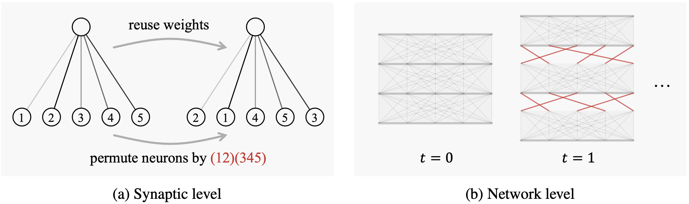

# RewireNeuron
Code for NeurIPS 2023 paper [Rewiring Neurons in Non-Stationary Environments](https://proceedings.neurips.cc/paper_files/paper/2023/file/599221d7ebf6b3403190f38a3f282a1c-Paper-Conference.pdf).



## Requirements
* Make sure you have [PyTorch](https://pytorch.org/get-started) and [JAX](https://github.com/google/jax#pip-installation-gpu-cuda) installed with CUDA support.
* Install [SaLinA](https://github.com/facebookresearch/salina#quick-start) and [Continual World](https://github.com/awarelab/continual_world#installation) following their instructions. Note that the latter only supports [MuJoCo version 2.0](https://roboti.us/download.html).
* Install additional packages via `pip install -r requirements.txt`.

## Getting started
Simply run the file `run.py` with the desired config available in [configs](configs/):
```shell
python run.py -cn=METHOD scenario=SCENARIO OPTIONAL_CONFIGS
```

### Available methods
<details><summary>Expand</summary>
<p>

We present 9 different CRL methods all built on top of soft-actor critic algorithm. To try them, just add the flag `-cn=my_method` on the command line. You can find the hyperparameters in [configs](configs):
* `rewire`: our method in "Rewiring Neurons in Non-Stationary Environments".
* `ft_1`: Fine-tune a single policy during the whole training.
* `sac_n`: Fine-tune and save the policy at the end of the task. Start with a randomized policy when encountering a new task.
* `ft_n`: Fine-tune and save the policy at the end of the task. Clone the last policy when encountering a new task.
* `ft_l2`: Fine-tune a single policy during the whole training with a regularization cost (a simpler EWC method).
* `ewc`: see the paper [Overcoming catastrophic forgetting in neural networks](https://www.pnas.org/doi/epdf/10.1073/pnas.1611835114).
* `pnn`: see the paper [Progressive Neural Networks](https://arxiv.org/pdf/1606.04671.pdf).
* `packnet`: see the paper [PackNet: Adding Multiple Tasks to a Single Network by Iterative Pruning](https://openaccess.thecvf.com/content_cvpr_2018/papers/Mallya_PackNet_Adding_Multiple_CVPR_2018_paper.pdf).
* `csp`: see the paper [Building a Subspace of Policies for Scalable Continual Learning](https://openreview.net/pdf?id=UKr0MwZM6fL).
</p>
</details>

### Available scenarios
<details><summary>Expand</summary>
<p>

We integrate 9 CRL scenarios over 3 different [Brax](https://github.com/google/brax) domains and 2 scenarios of the [Continual World](https://github.com/awarelab/continual_world) domain. To try them, just add the flag `scenario=...` on the command line:
* `halfcheetah/forgetting`: 8 tasks - 1M samples for each task.
* `halfcheetah/transfer`: 8 tasks - 1M samples for each task.
* `halfcheetah/robustness`: 8 tasks - 1M samples for each task.
* `halfcheetah/compositionality`: 8 tasks - 1M samples for each task.
* `ant/forgetting`: 8 tasks - 1M samples for each task.
* `ant/transfer`: 8 tasks - 1M samples for each task.
* `ant/robustness`: 8 tasks - 1M samples for each task.
* `ant/compositionality`: 8 tasks - 1M samples for each task.
* `humanoid/hard`: 4 tasks - 2M samples for each task.
* `continual_world/t1-t8`: 8 triplets of 3 tasks - 1M samples for each task.
* `continual_world/cw10`: 10 tasks - 1M samples for each task.
</p>
</details>

### Repository structure
<details><summary>Expand</summary>
<p>

The `core.py` file contains the building blocks of this framework. Each experiment consists in running a `Framework` over a `Scenario`, i.e. a sequence of train and test `Task`. The models are learning procedures that use CRL agents to interact with the tasks and learn from them through one or multiple algorithms.
* [frameworks](frameworks/) contains generic learning procedures (e.g. using only one algorithm, or adding a regularization method in the end).
* [scenarios](scenarios/) contains CRL scenarios i.e sequence of train and test tasks.
* [algorithms](algorithms/) contains different RL / CL algorithms (e.g. SAC, or EWC).
* [agents](agents/) contains CRL agents (e.g. PackNet, CSP, or Rewire).
* [configs](configs/) contains the configs files of benchmarked methods/scenarios.
</p>
</details>

## Acknowledgement
Our implementation is based on:
* [SaLinA](https://github.com/facebookresearch/salina) with multiple CRL scenarios and methods already in place.
* [SoftSort](https://github.com/sprillo/softsort) for parameter-efficient differentiable sorting.
